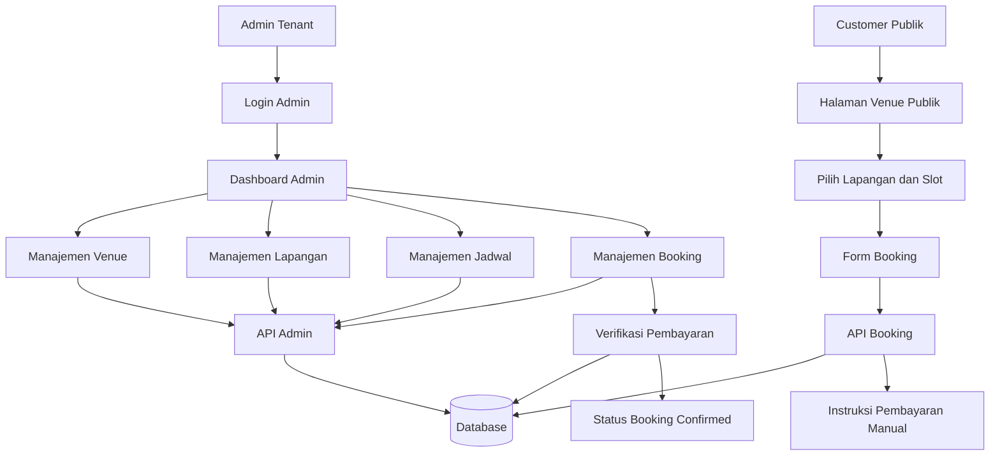
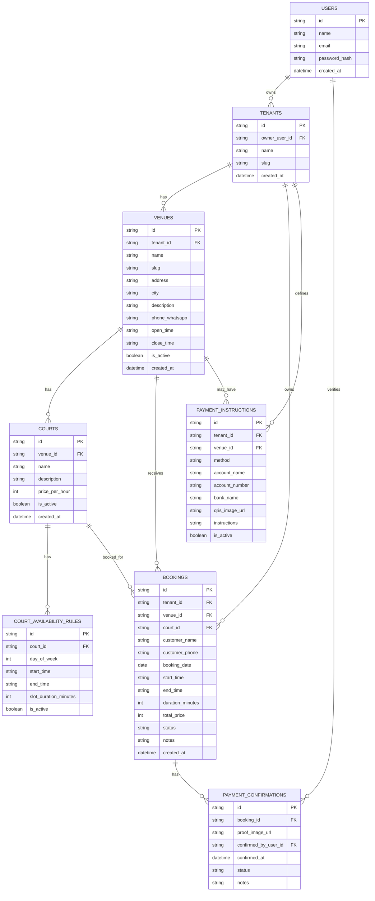

# PRD — Project Requirements Document

## 1. **Overview**

Aplikasi ini adalah platform booking lapangan padel berbasis web untuk pemilik venue di Indonesia. Sistem bersifat multitenant, artinya setiap pemilik venue/admin bisnis dapat memiliki akun sendiri, mengelola banyak lapangan, mengatur jadwal ketersediaan, menerima booking dari customer publik, dan memverifikasi pembayaran manual.

Masalah utama yang diselesaikan:

- Pemilik venue masih menerima booking lewat WhatsApp/manual sehingga rawan bentrok jadwal.
- Customer sulit melihat slot lapangan yang tersedia secara real-time.
- Admin venue perlu cara sederhana untuk mengelola lapangan, jadwal, booking, dan status pembayaran.

Tujuan utama aplikasi:

- Menyediakan landing page publik untuk setiap venue.
- Memungkinkan customer booking tanpa login.
- Memberikan dashboard admin untuk pemilik venue mengelola banyak lapangan.
- Mendukung pembayaran manual seperti transfer bank/QRIS dan verifikasi oleh admin.

## 2. **Requirements**

- Sistem harus mendukung banyak tenant/pemilik venue dalam satu aplikasi.
- Setiap tenant dapat memiliki satu atau lebih venue/lokasi bisnis.
- Setiap venue dapat memiliki banyak lapangan padel.
- Customer publik dapat melihat daftar lapangan, jadwal tersedia, harga, dan melakukan booking tanpa membuat akun.
- Booking harus memiliki status yang jelas, seperti pending payment, paid/confirmed, cancelled, dan completed.
- Sistem harus mencegah double booking pada lapangan, tanggal, dan jam yang sama.
- Admin tenant dapat login untuk mengelola lapangan, jadwal, harga, booking, dan pembayaran manual.
- Admin dapat mengatur informasi pembayaran manual, misalnya nomor rekening, instruksi transfer, atau QRIS.
- Customer dapat mengisi data dasar seperti nama, nomor WhatsApp, tanggal, jam, durasi, dan catatan.
- Sistem harus mobile-friendly karena mayoritas pengguna Indonesia kemungkinan booking melalui HP.
- Setiap tenant sebaiknya memiliki halaman publik sendiri, misalnya `/venue/nama-venue` atau subdomain di versi lanjutan.
- MVP tidak membutuhkan login customer dan tidak membutuhkan payment gateway otomatis.

## 3. **Core Features**

- **Landing Page Utama Platform**
  - Menjelaskan manfaat aplikasi untuk pemilik venue padel.
  - CTA untuk daftar sebagai pemilik venue.
  - Showcase fitur seperti jadwal online, booking tanpa ribet, dan dashboard admin.

- **Dashboard Admin Tenant**
  - Ringkasan booking hari ini, booking mendatang, pendapatan estimasi, dan status pembayaran.
  - Akses cepat untuk mengelola lapangan dan jadwal.

- **Manajemen Venue**
  - Admin dapat membuat dan mengedit profil venue.
  - Data venue mencakup nama, alamat, nomor WhatsApp, deskripsi, foto, dan jam operasional.

- **Manajemen Lapangan**
  - Admin dapat menambah, mengedit, dan menonaktifkan lapangan.
  - Setiap lapangan memiliki nama, tipe, harga per jam, status aktif, dan foto opsional.

- **Manajemen Jadwal & Slot**
  - Admin dapat menentukan jam operasional dan slot booking.
  - Slot dapat dibuat berdasarkan durasi, misalnya 60 menit atau 90 menit.
  - Sistem menampilkan slot yang tersedia dan menutup slot yang sudah dibooking.

- **Halaman Booking Publik**
  - Customer dapat memilih venue, lapangan, tanggal, jam, dan durasi.
  - Customer mengisi nama, nomor WhatsApp, dan catatan tambahan.
  - Customer melihat ringkasan harga sebelum konfirmasi.

- **Pembayaran Manual**
  - Setelah booking, customer mendapatkan instruksi pembayaran manual.
  - Admin dapat mengubah status booking setelah pembayaran dikonfirmasi.
  - Opsional MVP: customer dapat upload bukti pembayaran.

- **Manajemen Booking**
  - Admin dapat melihat semua booking dalam tampilan list dan kalender.
  - Admin dapat memfilter berdasarkan tanggal, lapangan, dan status.
  - Admin dapat mengubah status booking menjadi confirmed, cancelled, atau completed.

- **Notifikasi WhatsApp Link**
  - Setelah booking, sistem dapat menampilkan tombol WhatsApp untuk menghubungi venue.
  - Admin dapat menghubungi customer melalui link WhatsApp dari dashboard.

## 4. **User Flow**

### Flow Customer Publik

1. Customer membuka halaman publik venue.
2. Customer melihat informasi venue dan daftar lapangan.
3. Customer memilih lapangan yang diinginkan.
4. Customer memilih tanggal dan slot jam yang tersedia.
5. Customer mengisi nama, nomor WhatsApp, dan catatan opsional.
6. Customer melihat ringkasan booking dan total harga.
7. Customer menekan tombol konfirmasi booking.
8. Sistem membuat booking dengan status `pending_payment`.
9. Customer melihat instruksi pembayaran manual.
10. Customer melakukan transfer/QRIS sesuai instruksi.
11. Customer menghubungi admin via WhatsApp atau upload bukti pembayaran jika fitur upload diaktifkan.
12. Admin memverifikasi pembayaran dan mengubah status menjadi `confirmed`.

### Flow Admin Tenant

1. Admin mendaftar atau login ke dashboard.
2. Admin membuat profil venue.
3. Admin menambahkan data lapangan.
4. Admin mengatur harga, jam operasional, dan slot booking.
5. Admin menerima booking dari customer publik.
6. Admin memeriksa detail booking dan status pembayaran.
7. Admin memverifikasi pembayaran manual.
8. Admin mengelola perubahan status booking, pembatalan, atau penyelesaian booking.

## 5. **Architecture**

Aplikasi menggunakan arsitektur full-stack web app. Frontend menangani landing page, halaman booking publik, dan dashboard admin. Backend/API menangani autentikasi admin, data tenant, venue, lapangan, slot, booking, dan status pembayaran. Database menyimpan semua data dengan pemisahan berdasarkan tenant agar setiap admin hanya dapat mengakses data miliknya.

Komponen utama:

- **Public Website**: landing page platform dan halaman publik venue.
- **Booking Engine**: validasi slot, pembuatan booking, dan pencegahan double booking.
- **Admin Dashboard**: panel untuk pemilik venue mengelola operasional.
- **Authentication**: login hanya untuk admin tenant.
- **Tenant Isolation**: setiap data venue, lapangan, dan booking terhubung ke tenant tertentu.
- **Manual Payment Module**: menyimpan instruksi pembayaran dan status verifikasi.

## 6. **Database Schema**

Berikut struktur database high-level untuk MVP.

### `users`

Menyimpan data admin/pemilik venue.

- `id` — text/uuid, ID unik user.
- `name` — text, nama admin.
- `email` — text, email untuk login.
- `password_hash` — text, hash password jika tidak memakai auth provider eksternal.
- `created_at` — datetime, waktu akun dibuat.

### `tenants`

Menyimpan entitas bisnis/pemilik venue.

- `id` — text/uuid, ID unik tenant.
- `owner_user_id` — text/uuid, relasi ke user pemilik.
- `name` — text, nama bisnis atau brand tenant.
- `slug` — text, slug URL publik tenant.
- `created_at` — datetime, waktu tenant dibuat.

### `venues`

Menyimpan lokasi venue padel.

- `id` — text/uuid, ID unik venue.
- `tenant_id` — text/uuid, relasi ke tenant.
- `name` — text, nama venue.
- `slug` — text, slug URL venue.
- `address` — text, alamat lengkap.
- `city` — text, kota.
- `description` — text, deskripsi venue.
- `phone_whatsapp` — text, nomor WhatsApp venue.
- `open_time` — text/time, jam buka default.
- `close_time` — text/time, jam tutup default.
- `is_active` — boolean, status venue aktif.
- `created_at` — datetime, waktu venue dibuat.

### `courts`

Menyimpan data lapangan dalam sebuah venue.

- `id` — text/uuid, ID unik lapangan.
- `venue_id` — text/uuid, relasi ke venue.
- `name` — text, nama lapangan, misalnya Court 1.
- `description` — text, deskripsi singkat lapangan.
- `price_per_hour` — integer, harga per jam dalam Rupiah.
- `is_active` — boolean, status lapangan aktif.
- `created_at` — datetime, waktu lapangan dibuat.

### `court_availability_rules`

Menyimpan aturan ketersediaan lapangan.

- `id` — text/uuid, ID unik aturan.
- `court_id` — text/uuid, relasi ke lapangan.
- `day_of_week` — integer, hari dalam minggu, 0 Minggu sampai 6 Sabtu.
- `start_time` — text/time, jam mulai tersedia.
- `end_time` — text/time, jam selesai tersedia.
- `slot_duration_minutes` — integer, durasi slot dalam menit.
- `is_active` — boolean, status aturan aktif.

### `bookings`

Menyimpan data booking customer.

- `id` — text/uuid, ID unik booking.
- `tenant_id` — text/uuid, relasi ke tenant untuk isolasi data.
- `venue_id` — text/uuid, relasi ke venue.
- `court_id` — text/uuid, relasi ke lapangan.
- `customer_name` — text, nama customer.
- `customer_phone` — text, nomor WhatsApp customer.
- `booking_date` — date, tanggal booking.
- `start_time` — text/time, jam mulai.
- `end_time` — text/time, jam selesai.
- `duration_minutes` — integer, durasi booking.
- `total_price` — integer, total harga dalam Rupiah.
- `status` — text, status booking: pending_payment, confirmed, cancelled, completed.
- `notes` — text, catatan dari customer/admin.
- `created_at` — datetime, waktu booking dibuat.

### `payment_instructions`

Menyimpan instruksi pembayaran manual per venue atau tenant.

- `id` — text/uuid, ID unik instruksi pembayaran.
- `tenant_id` — text/uuid, relasi ke tenant.
- `venue_id` — text/uuid nullable, jika instruksi khusus per venue.
- `method` — text, metode pembayaran, misalnya bank_transfer atau qris.
- `account_name` — text, nama pemilik rekening.
- `account_number` — text, nomor rekening atau identifier pembayaran.
- `bank_name` — text, nama bank jika transfer bank.
- `qris_image_url` — text, URL gambar QRIS jika ada.
- `instructions` — text, instruksi tambahan untuk customer.
- `is_active` — boolean, status instruksi aktif.

### `payment_confirmations`

Menyimpan data konfirmasi pembayaran manual.

- `id` — text/uuid, ID unik konfirmasi.
- `booking_id` — text/uuid, relasi ke booking.
- `proof_image_url` — text nullable, URL bukti transfer jika upload diaktifkan.
- `confirmed_by_user_id` — text/uuid nullable, admin yang memverifikasi.
- `confirmed_at` — datetime nullable, waktu pembayaran diverifikasi.
- `status` — text, status konfirmasi: submitted, approved, rejected.
- `notes` — text, catatan verifikasi.

## 7. **Tech Stack**

Rekomendasi tech stack untuk MVP full-stack:

- **Framework**: Next.js
  - Cocok untuk landing page, halaman publik venue, dashboard admin, dan API route dalam satu project.

- **Styling**: Tailwind CSS
  - Mempercepat pembuatan UI modern, responsif, dan mudah dikustomisasi.

- **UI Components**: shadcn/ui
  - Cocok untuk dashboard admin, form booking, tabel booking, dialog, kalender, dan komponen SaaS modern.

- **ORM**: Drizzle ORM
  - Ringan dan cocok untuk schema database yang jelas.

- **Database**: SQLite untuk MVP lokal/demo
  - Sederhana untuk showcase dan cepat dikembangkan.
  - Jika produksi, bisa naik ke PostgreSQL.

- **Authentication**: Better Auth
  - Digunakan untuk login admin tenant.
  - Customer publik tidak perlu login.

- **Deployment**: Vercel
  - Mudah untuk deploy aplikasi Next.js.

- **File Upload Opsional**: UploadThing atau storage kompatibel S3
  - Untuk upload foto venue, foto lapangan, QRIS, dan bukti pembayaran jika fitur upload diaktifkan.

- **Enhancement Opsional**:
  - PostgreSQL untuk production-ready multitenant.
  - Midtrans/Xendit jika nanti ingin pembayaran otomatis.
  - WhatsApp Business API jika nanti ingin notifikasi otomatis, tetapi untuk MVP cukup gunakan link WhatsApp.
